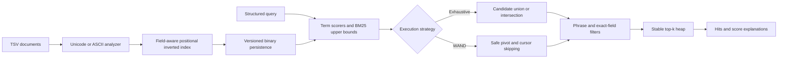

# IndexSail

[](https://github.com/appleweiping/IndexSail/actions/workflows/ci.yml)
[](https://www.rust-lang.org/)
[](LICENSE)

IndexSail is a compact local search and ranking engine written from scratch in safe Rust. It has no
runtime or build dependencies beyond the Rust standard library. The project is intended for learning,
small offline collections, reproducible retrieval experiments, and as a clear reference implementation
of the path from text to ranked results.

It is an independent implementation. Its code, API, file format, documentation, and examples were not
copied or adapted from an existing search project.

## What is included

- Named-field documents with stable external IDs.
- Deterministic Unicode and ASCII analysis modes.
- A positional inverted index with term frequency, document frequency, field length, and average field
  length statistics.
- BM25 ranking with configurable `k1` and `b`.
- Boolean `AND` and `OR` semantics.
- Field-restricted terms, adjacent phrase filters, and exact stored-field filters.
- Stable top-k ordering: score descending, then insertion ID ascending.
- An exhaustive executor and an exact WAND-style executor using safe per-term score upper bounds.
- Per-result BM25 explanations.
- A deterministic, versioned binary index format with structural validation and allocation limits.
- `index`, `search`, `inspect`, and reproducible `benchmark` CLI commands.
- More than 30 focused tests, a sample corpus, an end-to-end demo, CI, formatting, and lint policy.

## Architecture



The boundaries, invariants, WAND safety argument, and binary layout are described in
[docs/architecture.md](docs/architecture.md).

## Analyzer behavior

The analyzer configuration is stored in the index and reused for queries.

- `Unicode` is the default. It treats Rust `char::is_alphanumeric` characters as token characters and
  applies the standard library Unicode lowercase mapping.
- `ASCII` accepts only ASCII letters and digits and applies ASCII lowercase.

Both modes split at all other characters and use token ordinals as positions. The dependency-free
Unicode mode deliberately does **not** claim NFC, NFD, NFKC, language-aware word breaking, stemming,
stop-word removal, or accent folding. Canonically equivalent strings must already use the same Unicode
representation if they are expected to match.

## Build and test

Rust 1.85 or later is required.

```shell
cargo build --release
cargo test
cargo fmt --all -- --check
cargo clippy --all-targets -- -D warnings
```

On Windows, a complete MSVC Rust toolchain is recommended. The project itself contains no platform-
specific code.

## End-to-end example

The input format is UTF-8 TSV. Its first column must be `id`; every remaining header is a searchable
field. Tabs and embedded newlines are intentionally unsupported so parsing stays deterministic and
dependency-free.

```text
id<TAB>title<TAB>body<TAB>category
doc-1<TAB>Local Search<TAB>BM25 ranks local documents<TAB>guide
```

Build an index from the included corpus:

```shell
cargo run --release -- index --input examples/corpus.tsv --output examples/corpus.idx
```

Search all fields with safe WAND pruning and explanations:

```shell
cargo run --release -- search \
  --index examples/corpus.idx \
  --query "search ranking" \
  --operator or \
  --top-k 5 \
  --explain
```

Require both terms in `body`, an adjacent phrase, and an exact category:

```shell
cargo run --release -- search \
  --index examples/corpus.idx \
  --query "local search" \
  --field body \
  --operator and \
  --phrase "local search" \
  --phrase-field body \
  --filter category=guide
```

Inspect index statistics or a posting list:

```shell
cargo run --release -- inspect --index examples/corpus.idx
cargo run --release -- inspect --index examples/corpus.idx --field body --term search
```

PowerShell and POSIX demo scripts are included as
[`examples/demo.ps1`](examples/demo.ps1) and [`examples/demo.sh`](examples/demo.sh).

## Library example

```rust
use indexsail::{Analyzer, Document, IndexBuilder, SearchOptions, SearchQuery};

let analyzer = Analyzer::default();
let mut builder = IndexBuilder::new(analyzer);
builder.add_document(Document::from_fields(
    "doc-1",
    [("title", "Local search"), ("body", "BM25 ranking in Rust")],
)?)?;
let index = builder.finish();

let query = SearchQuery::from_text(analyzer, "rust ranking", None)?;
let results = index.search(&query, SearchOptions::default())?;
# Ok::<(), indexsail::Error>(())
```

## Ranking and pruning

For a term in a field, IndexSail uses Robertson/Sparck Jones-style positive BM25 IDF:

```text
idf = ln(1 + (N - df + 0.5) / (df + 0.5))

score = idf * tf * (k1 + 1)
              / (tf + k1 * (1 - b + b * field_length / average_field_length))
```

An unfielded query term becomes one logical scorer whose score is the sum of that term's matching field
contributions. Its upper bound is the maximum exact score in its sorted posting list. The WAND executor
adds those bounds in current-document order, chooses a pivot only when the retained top-k threshold can
still be met, and advances earlier cursors to the pivot. Equality is not pruned, preserving deterministic
tie-breaking. Phrase and exact-field filters are applied before a candidate enters the heap, so the
threshold is derived only from valid hits.

Use `--strategy full` to obtain the exhaustive reference result. Tests and the benchmark compare both
executors exactly.

## Persistence and trust boundary

`InvertedIndex::save` writes the analyzer mode, documents, field lengths, dictionary, posting lists,
term frequencies, and positions. `InvertedIndex::load` checks:

- signature and format version;
- UTF-8 and bounded string/collection sizes;
- unique document IDs and dictionary keys;
- strictly ordered document IDs and positions;
- matching term frequencies and position counts;
- valid document references and in-range positions;
- absence of trailing data.

The format is intentionally simple and currently version 1. It is not promised to be compatible with
future major versions.

## Reproducible benchmark

```shell
cargo run --release -- benchmark --documents 10000 --queries 200 --top-k 10 --seed 42
```

The benchmark generates the same skewed synthetic corpus and queries for the same seed, runs both
executors, verifies every returned document and score, and emits a deterministic checksum. Wall-clock
times are machine-dependent; corpus statistics, candidate counts, and the checksum are reproducible.
For comparisons, record the CPU, OS, Rust version, build profile, configuration line, and checksum.
The first measured project baseline is recorded in [docs/benchmark.md](docs/benchmark.md).

## Scope and non-goals

IndexSail is an in-memory, single-process engine. It does not implement distributed indexing, incremental
segment merging, compressed posting blocks, language-specific linguistic analysis, fuzzy matching, or
concurrent writes. The binary index is persisted to disk, but search loads it into memory. These choices
keep the core algorithms inspectable and the behavior deterministic.

## License and contributions

IndexSail is available under the [MIT License](LICENSE). See [CONTRIBUTING.md](CONTRIBUTING.md) for the
quality and review contract.
Security reporting and release history are documented in [SECURITY.md](SECURITY.md) and
[CHANGELOG.md](CHANGELOG.md).
