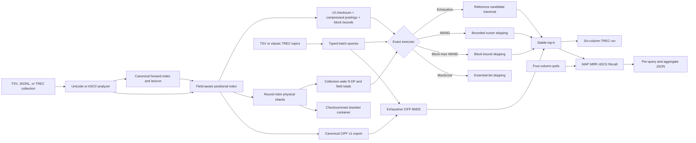

# IndexSail

[](https://github.com/appleweiping/IndexSail/actions/workflows/ci.yml)
[](https://www.rust-lang.org/)
[](LICENSE)

IndexSail is an information-retrieval experiment toolkit in safe Rust. It builds a
field-aware positional index, ranks with BM25, opt-in quantized BM25, DPH, PL2, or QLD, executes exact exhaustive, WAND, block-max WAND, or MaxScore top-k
queries, and runs
reproducible TREC-style experiments from collection ingestion through metrics and run files. A collection can also
be partitioned into independently searchable physical shards while using collection-wide statistics and an exact,
deterministic global top-k merge, or exported to and searched directly from the interoperable CIFF v1 format.
Native forward snapshots can be reordered by a seeded shuffle, document feature, validated explicit
mapping, or deterministic recursive graph bisection over the field-qualified document-term graph.

The design favors observable algorithms, deterministic results, explicit format contracts, and strict
input validation. It is useful for teaching, local research prototypes, regression oracles, and
experiments small enough to fit in one process.

## Capabilities

| Area | Included behavior |
|---|---|
| Collection | Bounded UTF-8 TSV, JSON Lines (native and PISA-style records), and a documented TREC SGML subset |
| Analysis | Deterministic Unicode or ASCII tokenization, stored with the index |
| Index | Named fields, stable external IDs, positions, field lengths, DF and collection statistics |
| Forward pipeline | Canonical field-qualified lexicon, occurrence-preserving forward snapshots, inspection, and exact inversion |
| Reordering | Seeded random, feature-sorted, explicit permutation, or bounded recursive graph bisection; bidirectional maps and rebuilt native indexes |
| Sharding | Deterministic round-robin physical shards, global BM25 statistics, stable merged top-k |
| Retrieval | BM25, `AND`/`OR`, fielded terms, phrases, exact field filters, explanations |
| Execution | Exhaustive oracle, exact WAND, block-max WAND, and MaxScore with stable tie-breaking |
| Experiments | TSV or classic TREC topics, qrels, six-column run files, JSON reports |
| Interchange | Bounded CIFF v1 import/export, d-gap decoding, direct BM25 and TREC batch evaluation |
| Metrics | MAP@k, MRR@k, nDCG@k, Recall@k, latency, candidates, advances and skips |
| Verification | Optional per-query bit-exact executor/exhaustive comparison |
| Storage | Checksummed v3 index format plus checksummed v1 sharded container; embedded v1/v2/v3 index reads |
| Operations | CLI, library API, Linux/Windows CI, strict Clippy, rustfmt and release tests |

IndexSail pins its direct runtime dependencies exactly. The pure-Rust `libm` implementation provides
cross-platform bit-stable BM25 IDF values; `same-file` provides real cross-platform filesystem identity checks;
and `serde`/`serde_json` implement strict, bounded JSON Lines record decoding. All transitive crates are locked.
There are no network or CLI-framework dependencies.

## Architecture



The module boundaries, invariants, WAND safety argument, and binary layout are detailed in
[docs/architecture.md](docs/architecture.md). Experiment formats and metric definitions are in
[docs/evaluation.md](docs/evaluation.md). The exact CIFF wire, validation, scoring, and lossiness contracts are in
[docs/ciff.md](docs/ciff.md). The collection protocols, forward format, canonical lexicon, inversion invariants, and
resource bounds are specified in [docs/forward-index.md](docs/forward-index.md).
The supported document-ID reordering methods and native-format boundaries are in
[docs/reordering.md](docs/reordering.md).

## Build and quality gates

Rust 1.85 or later is required.

```shell
cargo build --release
cargo fmt --all -- --check
cargo clippy --all-targets -- -D warnings
cargo test --release --all-targets
```

CI runs formatting and strict Clippy on Ubuntu; release tests and builds run on Ubuntu and Windows. A
deterministic executor benchmark plus complete TREC evaluation, sharded, CIFF, forward-index, and
document-reordering lifecycles run on Ubuntu.

## Quick start: local TSV collection

The TSV header begins with `id`; every remaining column becomes a searchable stored field. Tabs and
embedded newlines inside values are intentionally unsupported.

```text
id<TAB>title<TAB>body<TAB>category
doc-1<TAB>Local Search<TAB>BM25 ranks local documents<TAB>guide
```

```shell
cargo run --release -- index \
  --input examples/corpus.tsv \
  --output target/corpus.idx

cargo run --release -- search \
  --index target/corpus.idx \
  --query "search ranking" \
  --operator or \
  --top-k 5 \
  --explain

cargo run --release -- inspect \
  --index target/corpus.idx \
  --field body \
  --term search
```

`inspect` reports collection statistics, persisted file size, and fixed-width versus encoded posting
bytes. It can also display one normalized posting list.

## Inspectable forward-index pipeline

Use `forward-build` when parsing, tokenization, and inversion need to be separate reproducible stages. The committed
JSONL example uses the canonical `{"id":"...","fields":{"title":"...","body":"..."}}` shape; the adapter also
accepts PISA-style `{"title":"document-id","content":"...","url":"..."}` records. The lexicon is sorted by
`(field, normalized term)`, so its identifiers do not depend on source document order.

```shell
cargo run --release -- forward-build \
  --input examples/collection.jsonl \
  --output target/collection.fwd \
  --format jsonl

cargo run --release -- forward-inspect \
  --index target/collection.fwd \
  --document 0 \
  --limit 12

cargo run --release -- lexicon \
  --index target/collection.fwd \
  --field body \
  --term retrieval

cargo run --release -- forward-invert \
  --input target/collection.fwd \
  --output target/collection.idx
```

The `IDXFW001` snapshot preserves original fields and every normalized occurrence, stores the analyzer mode, and is
validated against a fresh analysis before use. The resulting native index has the same positional semantics as direct
indexing and can be passed to `search`, `batch`, sharding, or CIFF export. Run the complete example with
[`examples/forward_demo.sh`](examples/forward_demo.sh) or
[`examples/forward_demo.ps1`](examples/forward_demo.ps1).

## Deterministic physical sharding

`shard-index` streams TSV, JSONL, or TREC records directly into round-robin physical builders, assigning global
insertion IDs without first retaining a second monolithic index. `shard-search` queries each shard independently, but computes every BM25 value from one aggregate
snapshot: global document count, per-field token totals, and per-field term document frequencies. It then
maps local IDs back to original global IDs and merges the shard-local top-k lists by score descending and
global ID ascending.

```shell
cargo run --release -- shard-index \
  --input examples/corpus.tsv \
  --output target/corpus.shards.idx \
  --shards 4

cargo run --release -- shard-search \
  --index target/corpus.shards.idx \
  --query "search ranking" \
  --strategy block-max-wand \
  --top-k 5 \
  --explain

cargo run --release -- shard-inspect \
  --index target/corpus.shards.idx \
  --field body \
  --term search
```

The format is a checksummed container of independently validated v3 indexes. It stores the global document
count and physical shard count, while the global scoring snapshot is recomputed from validated shard data on
load. The round-robin mapping needs no routing table: `shard = global_id % shard_count` and
`local_id = global_id / shard_count`. Duplicate external IDs across shards, analyzer disagreement, an invalid
shard population, checksum damage, truncation, and trailing bytes are rejected.

Persistence uses a bounded two-pass protocol. Writing counts and checksums deterministic shard bytes before
emitting them; loading requires a seekable source, validates the outer checksum and EOF in 8-KiB chunks, then
parses one embedded index at a time. `shard-inspect` reports the observed embedded version set, including mixed
v1/v2/v3 containers, rather than assuming the current writer version.

`shard-batch` accepts the same topics, qrels, run, report, scoring, and `--verify` options as `batch`. The
library's generic `evaluate_batch` API accepts either `InvertedIndex` or `ShardedIndex` through the
`RetrievalBackend` contract.

Run the complete committed example with
[`examples/shard_demo.sh`](examples/shard_demo.sh) or
[`examples/shard_demo.ps1`](examples/shard_demo.ps1).

The exactness claim is executable: deterministic tests compare every sharded executor against a monolithic
exhaustive oracle over OR/AND queries, multiple cutoffs, custom BM25 parameters, fielded and unfielded terms,
phrases, filters, explanations, equal-score ties, empty shards, and persistence round trips. Comparisons
require identical global document IDs, order, and IEEE-754 score bits. For sharded block-max WAND, local
persisted bounds are deliberately not reused because they were built from local statistics; conservative
bounds are instead derived from the globally scored postings and counted in
`block_max_postings_scanned`.

## CIFF v1 interoperability

IndexSail implements the official Common Index File Format v1 delimited protobuf wire contract in safe Rust,
without adding a general protobuf runtime. The reader bounds every frame and aggregate collection count, decodes
posting document IDs from d-gaps, keeps the header's global statistics, skips supported unknown fields, and rejects
wrong wire types, duplicate known scalars, invalid UTF-8, overflow, inconsistent `df`/`cf`, missing DocRecords,
truncation, and trailing messages.

```shell
cargo run --release -- ciff-export \
  --index target/corpus.idx \
  --output target/corpus.ciff \
  --description "local experiment"

cargo run --release -- ciff-inspect \
  --index target/corpus.ciff \
  --term search

cargo run --release -- ciff-search \
  --index target/corpus.ciff \
  --query "local search" \
  --top-k 10

cargo run --release -- ciff-batch \
  --index target/corpus.ciff \
  --topics examples/topics.tsv \
  --qrels examples/qrels.txt \
  --run target/ciff.run \
  --report target/ciff-report.json
```

Native export necessarily flattens named fields: frequencies for the same normalized term are summed and field
lengths become one document length. CIFF has no source text, fields, positions, phrases, stored filters, or native
impact bounds, so `CiffIndex` is deliberately separate from `InvertedIndex` and currently uses exhaustive BM25.
The query analyzer is caller-selected because CIFF describes tokenization but does not standardize it.
BM25 requires conventional frequency-valued `Posting.tf` payloads. Learned-sparse CIFF producers may instead put
quantized impacts in that field; IndexSail accepts, inspects, and round-trips those files without imposing a false
frequency/token-count relationship, but does not present BM25 over impacts as learned-impact retrieval. Repeated
query tokens and explicit library `QueryTerm` boosts are normalized and summed deterministically.

Run the complete offline lifecycle with [`examples/ciff_demo.sh`](examples/ciff_demo.sh) or
[`examples/ciff_demo.ps1`](examples/ciff_demo.ps1). The normative schema is the OSIRRC
[`CommonIndexFileFormat.proto`](https://github.com/osirrc/ciff/blob/master/src/main/protobuf/CommonIndexFileFormat.proto);
[the detailed contract](docs/ciff.md) records format semantics and trust boundaries.

## Reproducible TREC-style experiment

The workflow is three steps: index a collection, supply topics and judgments, then run one `batch`
command that writes a six-column run file and a JSON report.

Everything those steps need is committed in `examples/`: a four-document synthetic collection
(`collection.trec`), three topics (`topics.tsv`), and five judgments (`qrels.txt`). Nothing is
downloaded and no network access is involved, so the commands below run as written on a checkout with
Rust 1.85 or later installed.

That bundled collection exists to demonstrate the formats, the executor verification, and the metric
definitions. It is far too small to be a benchmark, and no TREC corpus is included here. Reproducing a
published TREC result also requires that collection, its topics, and its qrels, which you must obtain
separately from their distributor under whatever agreement covers them; IndexSail neither ships nor
fetches such data. Convert what you obtain to TSV or to the `<DOC>` subset documented below, then run
the same three steps against it.

### 1. Index a collection

The local TREC adapter reads one `<DOC>` block at a time. `<DOC>` and `</DOC>` must be on separate lines;
each document requires exactly one `<DOCNO>`. `<TITLE>` and `<HEADLINE>` form `title`; repeated `<TEXT>`
and `<BODY>` sections form `body`. Unknown nested markup is stripped. This is a deliberate, tested subset,
not a general SGML parser.

```shell
cargo run --release -- index \
  --input examples/collection.trec \
  --output target/collection.idx \
  --format trec
```

### 2. Supply topics and judgments

Topics may be compact TSV:

```text
101<TAB>local search ranking
102<TAB>wand exhaustive retrieval
```

Classic `<top>` records containing `<num> Number: ...` and `<title> ...` lines are also accepted. Qrels
use the conventional whitespace-separated layout:

```text
topic  iteration  document  relevance
101    0          DOC-001   2
```

Duplicate topic IDs and duplicate topic/document judgments are rejected instead of being resolved
silently. Positive relevance means relevant; graded values from 1 through 31 contribute to nDCG.
Topic files are capped at 64 MiB. Qrels are parsed with a 64 MiB total input
ceiling and a 64 KiB raw-line ceiling, with both limits enforced while reading.

### 3. Run, verify, and evaluate

```shell
cargo run --release -- batch \
  --index target/collection.idx \
  --topics examples/topics.tsv \
  --qrels examples/qrels.txt \
  --run target/indexsail.run \
  --report target/report.json \
  --field body \
  --top-k 10 \
  --strategy wand \
  --verify
```

`--verify` executes the alternative strategy for every topic and rejects the batch unless document IDs,
rank order, and floating-point score bits match. Verification time is reported separately from selected-
strategy search time. The run file follows `topic Q0 docid rank score tag`; the JSON contains configuration,
per-query results and metrics, aggregate metrics, timing, candidate evaluations, posting advances, and skips.

Against the bundled example the two steps print:

```text
indexed documents=4 fields=2 terms=42 postings=43 tokens=44 output=target/collection.idx
batch topics=3 hits=4 strategy=Wand verified=true elapsed_ms=0.117 evaluated=4 advanced=5 skipped=0 block_max_bounds_loaded=0 block_max_postings_covered=0 block_max_postings_scanned=0 run=target/indexsail.run
metrics map=1.000000 mrr=1.000000 ndcg=0.932236 recall=1.000000
report=target/report.json
```

and `target/indexsail.run` contains:

```text
101 Q0 DOC-002 1 1.188291537699 indexsail
101 Q0 DOC-001 2 1.129449040647 indexsail
102 Q0 DOC-002 1 2.376583075399 indexsail
103 Q0 DOC-004 1 1.188291537699 indexsail
```

Every value above is deterministic except `elapsed_ms`, which is wall-clock time and differs per machine
and per run. The three topics each retrieve all of their relevant documents, so `map`, `mrr`, and
`recall` are 1; `ndcg` is below 1 because topic 101 ranks its grade-1 judgment above its grade-2
judgment.

Run the included workflow directly:

```shell
sh examples/trec_demo.sh
```

```powershell
./examples/trec_demo.ps1
```

## Query semantics

For a term in one field, IndexSail uses positive Robertson/Sparck Jones-style BM25 IDF:

```text
idf = ln(1 + (N - df + 0.5) / (df + 0.5))

score = idf * tf * (k1 + 1)
              / (tf + k1 * (1 - b + b * field_length / average_field_length))
```

An unfielded term is one logical clause whose score is the sum of its contributions across indexed fields.
Duplicate logical terms combine boosts. Consequently `AND` means every unique logical term must match,
not every field expansion. Phrase filters require adjacent normalized token positions within one field.
Exact field filters compare stored strings without analysis.

Top-k order is always score descending and then internal insertion ID ascending. The same heap rule is used
by both executors, including at an equal-score WAND threshold.

### DPH scoring (exhaustive only)

Native `search`, `shard-search`, `batch`, and `shard-batch` accept `--scorer dph`. DPH uses the collection-wide
number of term **occurrences** (`cf`), not document frequency (`df`), and the average length of the term's field:

```text
f = tf / field_length
DPH = ((1 - f)^2 / (tf + 1)) *
      (tf * log2((tf * average_field_length / field_length) * (N / cf))
       + 0.5 * log2(2 * pi * tf * (1 - f)))
```

At `tf == field_length`, the continuous limit is zero; IndexSail returns zero instead of a NaN. Negative finite
impacts are retained, not clipped. Scores are calculated in `f64` and therefore are not claimed bit-identical to
PISA's `float` implementation. Sharded DPH aggregates `cf`, average field lengths, and document count across the
whole collection before scoring each physical shard. Explanations show `cf` for DPH; default BM25 output stays
unchanged. An unfielded term sums its field-specific DPH contributions.

```bash
indexsail search --index corpus.idx --query "local search" --scorer dph --explain
indexsail batch --index corpus.idx --topics topics.tsv --run dph.run --scorer dph
```

DPH may produce negative impacts, so `--strategy` defaults to `full` for DPH and WAND, block-max WAND, and
MaxScore are rejected. BM25 `--k1`/`--b`, batch `--verify`, CIFF retrieval, and the pruning benchmark are not
available for DPH. DPH JSON batch reports use schema version 2 and include `"scorer": "dph"`; default BM25 reports
retain schema version 1. This is one scorer family, not full PISA scorer or score-byte parity.

### PL2 scoring (exhaustive only)

Native `search`, `shard-search`, `batch`, and `shard-batch` also accept `--scorer pl2` with a finite positive
`--pl2-c` normalization parameter (default `1`). For term frequency `tf`, field length `dl`, average field length
`avgdl`, total collection occurrences `cf`, and collection size `N`, the impact is:

```text
tfn = tf * log2(1 + c * avgdl / dl)
f = cf / N
e = ln(1/2)
PL2 = (tfn * log2(1/f) + f * e + 0.5 * log2(2*pi*tfn)
       + tfn * (log2(tfn) - e)) / (tfn + 1)
```

This follows the frozen PISA PL2 expression, including its natural-log `e` term, but uses `f64` and does not
claim PISA `float` score-byte parity. `cf`, `avgdl`, and `N` are global even when searching a physical shard;
fielded terms use their field's own statistics, and unfielded terms sum field-specific impacts. Signed finite
impacts are retained. Invalid `c` and non-finite calculated impacts fail before a ranking is emitted.

```bash
indexsail search --index corpus.idx --query "local search" --scorer pl2 --pl2-c 2.5 --explain
indexsail batch --index corpus.idx --topics topics.tsv --run pl2.run --report pl2.json --scorer pl2
```

PL2 defaults to exhaustive `full`; WAND, block-max WAND, and MaxScore are rejected because safe PL2 bounds have
not yet been established. BM25 `--k1`/`--b`, batch `--verify`, CIFF retrieval, and the pruning benchmark remain
BM25-only. JSON batch reports use schema version 2 with `"scorer": "pl2"` and `"pl2_c"`; default BM25 stays
schema version 1. This is one additional scorer family, not full PISA scorer parity.

### QLD scoring (exhaustive only)

Native `search`, `shard-search`, `batch`, and `shard-batch` accept `--scorer qld`
with a finite positive Dirichlet smoothing `--qld-mu` (default `1000`). For a
field's document length `dl`, total collection length `cl`, term occurrences
`cf`, and document term frequency `tf`, the nonnegative term impact is:

```text
QLD = max(0, ln(mu / (dl + mu)) + ln(1 + tf * cl / (mu * cf)))
```

This follows the frozen PISA QLD term expression and its zero clamp, while
using `f64` instead of PISA's `float`. Each field has its own `cl`, `cf`, and
`dl`; an unfielded term sums contributions across fields. Sharded search uses
global field totals and occurrence counts, preserving native scores and ties
after save/load. Explanations show `cf` and `collection_len`; batch JSON uses
schema 2 with `"scorer": "qld"` and `"qld_mu"`. A non-finite score is rejected
before ranking.

```bash
indexsail search --index corpus.idx --query "local search" --scorer qld --qld-mu 100 --explain
indexsail batch --index corpus.idx --topics topics.tsv --run qld.run --report qld.json --scorer qld
```

QLD defaults to exhaustive `full`; WAND, block-max WAND, and MaxScore are
rejected until a safe bound is proved. BM25 `--k1`/`--b`, batch `--verify`,
CIFF retrieval, and the pruning benchmark remain BM25-only. This is not full
PISA scorer parity or a claim of floating-point bit equivalence.

### Opt-in quantized BM25

Native `search`, `shard-search`, `batch`, and `shard-batch` accept `--scorer qbm25`
with required `--quant-bits` (2–32) and `--quant-max` (positive finite). The
maximum is a caller-declared *index-wide* bound on each logical, field-merged
BM25 term contribution after its query boost. It is not auto-calibrated or
stored in the index. The same parameters must be reused for comparable runs;
any scored contribution above the maximum fails the request before results
are emitted. No saturation or silent clipping occurs.

For `range = 2^bits - 1`, a present posting with impact `s ∈ [0,max]` receives
`floor((s/max) * (range-1)) + 1`, with the exact endpoint clamped to `range`
against floating-point rounding. A present zero-impact posting maps to `1`;
an absent posting contributes `0`. Field contributions for the same logical
term are merged *before* quantization. All matching terms' integer impacts
are summed, then ranked by descending score and ascending insertion ID. A
maximum of 4096 distinct prepared query terms ensures even 32-bit scores sum
below `2^44`, exactly representable in the retrieval engine's `f64` carrier.
Near a bin boundary the `f64` divide/multiply result defines the bin; this is
not claimed bit-identical to PISA's `float` calculation.

```bash
indexsail search --index corpus.idx --query "local search" --scorer qbm25 --quant-bits 8 --quant-max 5 --strategy block-max-wand
indexsail batch --index corpus.idx --topics topics.tsv --run quant.run --report quant.json --scorer qbm25 --quant-bits 8 --quant-max 5 --verify
```

Exhaustive, WAND, block-max WAND, and MaxScore all use the exact materialized
integer impacts; the pruning upper bound is the outward-rounded maximum of
those impacts, not a bound on unquantized BM25. Thus an equal-score/lower-ID
tie remains eligible. Shards use global BM25 statistics and identical
quantization; their global-ID merge preserves the same tie order. `--verify`
compares the selected executor with exhaustive. Batch JSON uses schema 2 with
`"scorer": "qbm25"`, `"quant_bits"`, and `"quant_max"`. Quantized
`--explain` is deliberately rejected because the existing explanation format
reports field-wise floating contributions, not merged integer impacts. CIFF
retrieval and the synthetic pruning benchmark remain unquantized BM25-only.

## Exact WAND

Each logical term scorer materializes exact BM25 values and records a conservative upper bound rounded one
representable floating-point value outward. WAND accumulates those bounds in current-document order,
chooses a pivot only when the current threshold can still be met, and advances earlier cursors. It uses
`>=` at the pivot boundary, so an equal-score result that wins the document-ID tie-break is not pruned.

Phrase and exact-field constraints are evaluated before heap insertion. The heap threshold therefore comes
only from valid hits. Unit tests, randomized deterministic benchmarks, CI smoke tests, and batch `--verify`
all use exhaustive execution as a correctness oracle.

This implementation uses one bound per logical term. `--strategy block-max-wand` adds a second, tighter
bound described below.

## Exact MaxScore

MaxScore orders term scorers by their maximum possible contribution and maintains an essential suffix once
the top-k threshold is known. Documents occurring only in the low-impact prefix cannot reach that threshold,
so their postings are advanced without scoring. Every candidate from the essential terms is still scored with
the complete term set, and the same exhaustive oracle, post-filters, phrase checks, and tie-breaking rules
apply. `AND` queries use the exact intersection walk because MaxScore's essential-list optimization is
defined for disjunctive retrieval.

```bash
indexsail search --index corpus.idx --query "local search ranking" --strategy maxscore
```

The executor reports the same `evaluated`, `advanced`, and `skipped` counters as WAND. Batch `--verify`
compares MaxScore's document IDs, order, and score bits against exhaustive retrieval for every topic.

## Block-max WAND

One bound per term is set by the single highest-impact document that term touches, and stays that high for
every other document in the list. Remembering a maximum for each run of 64 postings lets a long stretch of
low-impact documents be skipped in one step instead of one document at a time.

```bash
indexsail search --index corpus.idx --query "local search ranking" --strategy block-max-wand
```

The ranking is unchanged. A block maximum is a true upper bound inside its block, the bound covers every
cursor that could contribute at the pivot, and the same `>=` boundary is used, so a result that wins on the
document-ID tie-break is still not pruned. All strategies share exact scoring and top-k maintenance; their
different pruning control flow is checked against exhaustive retrieval in randomized and end-to-end tests.

### When it helps, and when it does not

The gain comes entirely from how much impact varies inside a posting list, so it is worth measuring on your
own collection rather than assuming it:

| collection | query | k | scored by WAND | scored by block-max | change |
|---|---|---|---|---|---|
| skewed impacts, 20k docs | `common` | 10 | 20000 | 5568 | -72% |
| skewed impacts, 20k docs | `common mid` | 10 | 6685 | 2834 | -58% |
| skewed impacts, 20k docs | `common mid rare` | 10 | 331 | 327 | -1% |
| benchmark corpus, 100k docs | 500 mixed | 10 | 1,136,956 | 1,136,119 | -0.074% |

Block-max helps most where plain WAND helps least: a frequent term whose global bound prunes nothing. Where
WAND already reaches a small candidate set, little is left to remove, and the extra bound arithmetic may
outweigh the saved work. On the formal synthetic benchmark, repeated WAND and block-max timing ranges overlap
and reverse order, so they establish neither a latency win nor a loss. Real text collections are often more
skewed, which is the case the strategy is built for.

Block maxima are precomputed when an index is finalized and stored in format version 3. A field-qualified
stream and the deterministic all-field merge are both represented, so default-BM25 query preparation loads
one value per 64-posting block instead of rescanning scored postings. Custom valid BM25 parameters or boosts
derive maxima directly from their exact materialized scores; this preserves the full public parameter range
without relying on a numerically unsafe universal approximation. Version 1 and 2 files rebuild the default
table once during load, and a subsequent save upgrades them to version 3.

## Persistence and compression

New indexes use format version 3:

- a magic value and explicit format version;
- a payload length with allocation limits;
- a deterministic 64-bit FNV-1a payload checksum;
- stored documents, analyzer mode, field lengths, and sorted dictionary;
- per-term compressed posting blocks;
- one tight default-BM25 upper bound per 64-posting block for field-qualified and all-field logical term
  streams;
- positive document-ID and position gaps encoded as base-128 variable bytes;
- term frequency encoded as a variable byte and used as the position count;
- rejection of truncation, trailing bytes, checksum mismatch, integer overflow, non-UTF-8 data, duplicate
  keys, invalid references, and non-monotonic IDs or positions.

Version 1 and 2 indexes remain readable and are written as version 3 on the next save. Version 3 recomputes
and bit-compares its default bound table while loading, then default-BM25 queries consume the validated
persisted values. Custom BM25 parameters or boosts derive conservative block bounds directly from their
materialized exact scores and report that work in `block_max_postings_scanned`. The checksum detects
accidental damage; it is not authentication and must not be treated as protection from maliciously crafted
input. Exact layouts and trust boundaries are documented in [docs/architecture.md](docs/architecture.md).

The posting codec compresses postings only. Stored field text, dictionary strings, and block bounds remain
uncompressed, and search loads the entire index into memory. A cross-platform standard-library mmap API does
not exist, while this crate forbids unsafe code and intentionally limits itself to one pure-Rust math
dependency; v3 therefore keeps the ordinary buffered reader rather than claiming an mmap path that would
still materialize owned data.

## Library example

```rust
use indexsail::{Analyzer, Document, IndexBuilder, SearchOptions, SearchQuery};

let analyzer = Analyzer::default();
let mut builder = IndexBuilder::new(analyzer);
builder.add_document(Document::from_fields(
    "doc-1",
    [("title", "Local search"), ("body", "BM25 ranking in Rust")],
)?)?;
let index = builder.finish();

let query = SearchQuery::from_text(analyzer, "rust ranking", None)?;
let outcome = index.search(&query, SearchOptions::default())?;
assert_eq!(outcome.hits[0].external_id, "doc-1");
# Ok::<(), indexsail::Error>(())
```

The public batch API exposes `Topic`, `Qrels`, `BatchConfig`, `evaluate_batch`, `write_trec_run`, and
`write_json_report`, so experiments do not have to invoke the CLI.

To create a sharded collection from the same input order:

```rust
use indexsail::{Analyzer, Document, SearchOptions, SearchQuery, ShardedIndexBuilder};

let analyzer = Analyzer::default();
let mut builder = ShardedIndexBuilder::new(analyzer, 4)?;
builder.add_document(Document::from_fields(
    "doc-1",
    [("body", "globally scored physical shards")],
)?)?;
let index = builder.finish();
let query = SearchQuery::from_text(analyzer, "physical shards", Some("body"))?;
let outcome = index.search(&query, SearchOptions::default())?;
assert_eq!(outcome.hits[0].doc_id, 0);
# Ok::<(), indexsail::Error>(())
```

## 100k-document reproducible benchmark

```shell
sh examples/benchmark_100k.sh
```

```powershell
./examples/benchmark_100k.ps1
```

For seed 42, the generator creates 100,000 documents, 500 three-term queries, and 5,592,575 posting-list
entries. Two native Windows release repetitions on 2026-09-07 produced the following
correctness-backed observation (elapsed ranges show their variability):

| Executor | Evaluated candidates | Time range |
|---|---:|---:|
| Exhaustive | 12,927,028 | 9.65–10.42 s |
| WAND | 1,136,956 | 6.56–8.26 s |
| Block-max WAND | 1,136,119 | 8.16–17.35 s |

All three returned bit-identical top-10 results for every query, checksum `1310686fefd0b451`. The posting codec
used 19,097,862 bytes versus 76,340,600 fixed-width value bytes (ratio 0.2502, excluding dictionary and
stored documents). The v3 file was 70,139,763 bytes: 68,716,795 base bytes plus 1,422,968 bytes of block
metadata, a 2.07% increase over that base. Across the 500 block-max queries, 223,772 precomputed bounds from
the v3-persistable resident table covered
14,275,721 scored postings and zero postings were scanned specifically to derive bounds. On this near-uniform
workload the tighter bounds removed only 837 additional candidates; the overlapping, unstable timing ranges
do not establish a latency win. These numbers describe one machine and workload, not universal performance.
The benchmark queries the just-built resident index and serializes it afterward; “precomputed” does not
claim a disk reload in this measurement. The script writes configuration, timings, work and storage counters, compression statistics,
and checksum as schema-version-5 JSON. The table above is a frozen v0.3.0 observation and therefore omits
the MaxScore and sharded rows; current reports include MaxScore plus a configurable sharded block-max pass,
its independently measured build/search times, serialized bytes, and global-bound preparation counters. Full environment and measurement notes are in
[docs/benchmark.md](docs/benchmark.md).

## Reproducibility contract

For identical input bytes, insertion order, analyzer, query order, BM25 parameters, cutoff, and Rust
floating-point behavior, IndexSail provides:

- deterministic internal IDs, dictionaries, binary output, ranking and run order;
- stable seeded synthetic collections and queries;
- an executor checksum independent of wall-clock timing;
- explicit timing separation between selected search and verification;
- machine-readable reports that preserve both workload counters and environment-dependent durations.

Record the commit, Rust version, target, CPU, OS, build profile, command, checksum, and input dataset version
when publishing results.

## Scope and limitations

IndexSail is currently an in-memory, single-process research toolkit. Its physical shards are local and queried
serially; they are not network-distributed workers. It does not implement incremental segments, deletion,
replication, shard routing across services, memory mapping, language-specific stemming, stopword lists, fuzzy
matching, learning-to-rank, query expansion, or concurrent writes. Block-max metadata is an immutable
snapshot: it increases index-build work and file size in exchange for removing the additional bound-
derivation scan from default-BM25, unit-boost block-max queries. Custom parameters derive conservative
bounds from the already materialized scores. It does not claim state-of-the-art compressed-query throughput. Unicode analysis uses
standard-library alphanumeric boundaries and lowercase conversion; it does
not perform Unicode normalization or language-aware segmentation.

The local TREC reader supports the exact subset documented above. Convert other collection formats to TSV
or that subset before indexing. Large collections retain stored text and may use substantially more memory
than production engines.

## References

- S. Robertson and H. Zaragoza, “The Probabilistic Relevance Framework: BM25 and Beyond,” 2009.
- A. Broder et al., “Efficient Query Evaluation using a Two-Level Retrieval Process,” 2003.
- K. Järvelin and J. Kekäläinen, “Cumulated Gain-Based Evaluation of IR Techniques,” 2002.
- [PISA project overview at `e88b09f`](https://github.com/pisa-engine/pisa/blob/e88b09fedba2da15e3afa2345648b4407cb105f1/README.md) and
  its [`partition_fwd_index`](https://github.com/pisa-engine/pisa/blob/e88b09fedba2da15e3afa2345648b4407cb105f1/tools/partition_fwd_index.cpp) and
  [`shards`](https://github.com/pisa-engine/pisa/blob/e88b09fedba2da15e3afa2345648b4407cb105f1/tools/shards.cpp) tools, together with the
  [official sharding documentation](https://pisa.readthedocs.io/en/latest/sharding.html), consulted for the
  research-tool capability taxonomy (parsing, indexing, sharding, compression, query processing, and document
  reordering).

These references define standard retrieval ideas and evaluation measures; IndexSail's behavior is specified
by this repository's code, tests, and format documentation.

## License and contributions

IndexSail is available under the [MIT License](LICENSE). See [CONTRIBUTING.md](CONTRIBUTING.md) for the
quality and review contract, [SECURITY.md](SECURITY.md) for private vulnerability reporting, and
[CHANGELOG.md](CHANGELOG.md) for release history. The [release process](docs/releasing.md) documents
clean builds, checksums, the dependency SBOM, and build-provenance verification.
