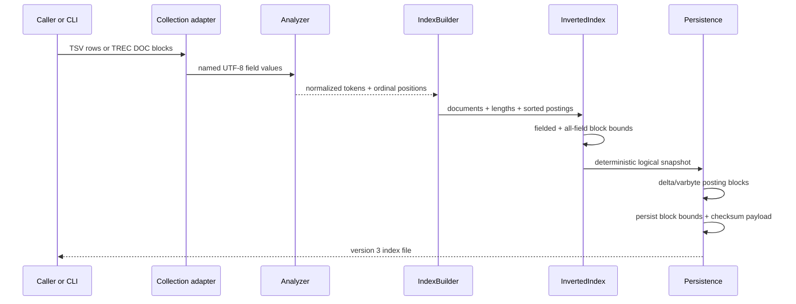
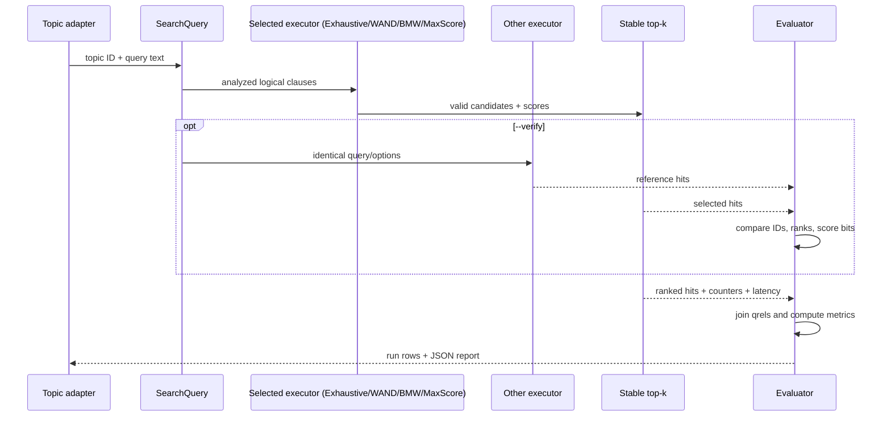

# IndexSail architecture and invariants

## Module map

| Module | Responsibility |
|---|---|
| `analysis` | Deterministic Unicode/ASCII tokenization, normalization, and positions |
| `document` | External identifiers and validated, deterministically ordered named fields |
| `index` | Builder, immutable document table, field lengths, dictionary, positional postings |
| `query` | Typed terms, `AND`/`OR`, phrase constraints, and exact-field filters |
| `search` | BM25 scorers, exhaustive/WAND/block-max WAND/MaxScore execution, stable heap, explanations and counters |
| `codec` | Posting gaps, base-128 variable bytes, codec statistics, payload checksum |
| `persistence` | v3 writer, v3/v2/v1 readers, checksums, bounds and structural validation |
| `trec` | Collection, topic and qrels adapters |
| `evaluation` | Batch execution, executor oracle, metrics, run and JSON writers |
| `benchmark` | Seeded workload, exhaustive/WAND oracle, checksum and JSON report |
| `cli` | Hand-written standard-library command parsing and end-to-end workflows |

## Build data flow



## Retrieval and evaluation flow



## Index invariants

1. Internal document IDs are zero-based insertion ordinals that fit in `u32`.
2. External IDs are unique, nonblank UTF-8 without NUL or line separators.
3. Field identifiers use `[A-Za-z0-9_.-]+` and are at most 128 bytes.
4. Dictionary keys are ordered `(field, normalized term)` pairs.
5. Every posting list is nonempty and strictly increasing by document ID.
6. Every position list is nonempty, strictly increasing, and below the stored field length.
7. `term_frequency == positions.len()` and is nonzero.
8. Stored field lengths equal re-analysis of stored field text.
9. Field totals use all documents in the average denominator, including documents missing that field.
10. Block-max streams exactly cover every fielded and all-field term stream, use 64-posting blocks, and
    contain finite bounds that bit-match recomputation from the postings.

The builder establishes these invariants. All persistence readers distrust and validate stored data again.

## Query preparation

Custom `QueryTerm` text must analyze to exactly one token. Terms with identical `(field, normalized term)`
keys combine by summing boosts, so duplicate input does not create duplicate Boolean clauses. An unfielded
term merges its score in every indexed field into one sorted logical posting list. `AND` therefore requires
each logical query term, not every field expansion.

Phrase constraints operate on positions within a single field. Exact filters compare a stored field value.
Both are post-scoring constraints but are checked before a candidate reaches the retained heap.

## Stable top-k

The heap exposes its worst retained hit: lowest score and then highest internal ID. A candidate replaces it
only if its score is higher or the score is bitwise equal and its internal ID is lower. Final output is score
descending and internal ID ascending. The rule is shared by exhaustive and WAND execution and produces
stable external run order for a stable insertion order.

## WAND safety argument

Each logical scorer materializes exact BM25 scores at its matching documents. Its bound is the next
representable floating-point value above the maximum finite score. Bound accumulation also rounds outward
by one representable value, preventing normal addition rounding from turning the stored value into a lower
bound.

Cursors are sorted by current document. Bounds are accumulated until the retained top-k threshold can be
met; that cursor defines the pivot. If no pivot exists, no future document can enter the heap. If earlier
cursors trail the pivot, advancing them cannot discard a competitive document because their accumulated
bounds were below threshold. At a matching pivot, the exact score is evaluated. The executor uses `>=`,
not `>`, so an equal-score candidate that wins the ID tie-break remains eligible.

Post-filters can only remove documents. Because filtered candidates do not enter the heap, pruning never
uses a threshold contributed by an invalid result.

Plain WAND uses this one bound per logical term. Block-max WAND adds a per-block refinement without changing
the pivot, exact-scoring, heap, constraint, or tie-breaking code. Default parameters consume the persisted
table below; custom parameters derive conservative bounds from their materialized scores.

## MaxScore safety argument

MaxScore sorts logical term scorers by ascending exact upper bound. After the heap is full, it sums the bounds
of the low-impact prefix. A prefix is non-essential only when that sum is strictly below the retained
threshold; strictness preserves a candidate that could tie on score and win by lower internal document ID.
Only the remaining essential suffix generates candidate document IDs. Before each candidate is scored, all
terms are consulted in original ordinal order, so floating-point addition is bit-stable and non-essential
terms still contribute to the final score. Prefix postings are advanced past candidates, and the executor
terminates when their total bound is strictly below the threshold. Conjunctive queries use the exhaustive
intersection traversal, because the essential-list proof is for disjunctions.

## Persisted block-max invariants

Each logical posting stream is partitioned into consecutive runs of 64 scored postings. The index stores
streams for every `(field, normalized term)` and for the deterministic merge of that term across all fields.
This mirrors the two query shapes exactly; an unfielded query never has to approximate block boundaries from
independent field lists.

One non-negative finite `default_bound` is stored for each block: the outward-rounded maximum score at
default BM25 (`k1=1.2`, `b=0.75`) and unit boost. The exactly pinned pure-Rust logarithm gives IDF the same
bits on the Linux and Windows CI targets. Version 3 loading recomputes the table from validated postings and
requires bit-for-bit equality before making the index searchable; version 1 and 2 loading computes it once.

The public API accepts every finite positive `k1` and boost. Fixed ULP padding cannot prove a
parameter-independent floating-point bound over that entire range, so custom requests derive block maxima
directly from their already materialized exact scores. This is conservative by construction and is counted
in `block_max_postings_scanned`. Default requests copy the persisted tight bounds and keep that counter at
zero.

## Persistence format version 3

All fixed-width integers are little-endian. A string is a `u32` byte length followed by UTF-8 bytes.

```text
8 bytes  magic: IDXSAL03
u32      version: 3
u64      payload byte length
u64      FNV-1a checksum of payload bytes
payload:
  u8     analyzer mode
  u32    document count
  repeat document count:
    string external id
    u32 field count; repeat: string field, string stored value
    u32 length count; repeat: string field, u32 token length
  u32 dictionary size
  repeat dictionary size:
    string field
    string normalized term
    u32 posting count
    u32 compressed block byte length
    bytes compressed posting block
  u32 block size: 64
  u32 block-max stream count
  repeat block-max stream count:
    u8 field scope: 0 = all fields, 1 = one field
    if scope == 1: string field
    string normalized term
    u32 scored posting count
    u32 block count; must equal ceil(posting count / 64)
    repeat block count:
      u64 IEEE-754 bits of default bound
EOF required
```

Within one compressed block, each posting stores:

1. positive document gap: first is `doc_id + 1`, later values are `doc_id - previous_doc_id`;
2. term frequency;
3. exactly `term_frequency` positive position gaps: first is `position + 1`, later values are differences.

Every integer uses little-endian base-128 variable bytes: seven payload bits per byte and the high bit means
another byte follows. A `u32` may consume at most five bytes, and unused high bits in byte five must be zero.
Zero gaps, overflow, truncation, trailing block bytes, and count mismatches are rejected.

The file reader first validates signature, version, bounded payload size, exact EOF, and checksum. It then
parses bounded strings and collections, decodes blocks, rejects duplicate keys, invokes all index
invariant checks, and verifies the complete block-bound table. The checksum detects accidental changes but
is deliberately non-cryptographic.

The writer buffers the logical payload to compute its checksum. This temporarily requires memory in
addition to the already in-memory index. The payload safety limit is 4 GiB, while individual strings and
posting blocks have smaller limits. Reads remain buffered and materialize owned structures: safe Rust's
standard library has no cross-platform mmap facility, and adding an mmap dependency would not make this
owned representation zero-copy.

## Legacy version 1 and 2 reads

The reader recognizes `IDXSAL01` plus version `1`. Its document layout is the same logical data, but each
posting contains fixed-width absolute `doc_id`, `term_frequency`, explicit position count, and absolute
positions. The reader also recognizes checksummed `IDXSAL02` version 2 files with the same compressed posting
layout as version 3 but no block-max section. Both legacy formats are read-only compatibility: their bounds
are built once during load and every new save uses version 3.

## TREC adapter trust boundary

- Topic IDs, TREC document IDs, and run tags must contain no whitespace.
- Topic files reject empty text and duplicates.
- Qrels require exactly four columns and one judgment per topic/document pair.
- Relevance above 31 is rejected to keep exponential gain finite and reproducible.
- TREC collection records are streamed and limited to 64 MiB each.
- `<DOC>` markers must be line-separated; exactly one `<DOCNO>` is required.
- Only documented content tags are extracted. Unknown nested markup is removed.

The adapter is deterministic and narrow. It is not an XML/SGML compatibility layer.

## Reproducibility versus timing

Dictionary order, binary output, top-k order, benchmark workload, workload counters, and checksum are
deterministic for identical inputs and configuration. `Instant` timings are observational and vary with the
machine, thermal state, other processes, filesystem, compiler, and build profile. JSON reports keep these
two categories separate.
