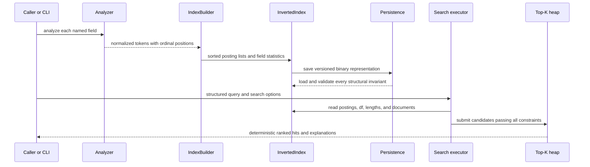

# IndexSail architecture and invariants

## Data flow



## Components

- `analysis`: dependency-free Unicode/ASCII tokenization and normalization contract.
- `document`: stable external IDs and deterministic named-field storage.
- `index`: immutable document table, per-document field lengths, dictionary, and positional postings.
- `query`: typed Boolean operator, fielded terms, phrase constraints, and exact-field filters.
- `search`: BM25 scoring, logical term scorers, exhaustive execution, WAND execution, top-k, and
  explanation reconstruction.
- `persistence`: little-endian version 1 reader/writer and corruption checks.
- `benchmark`: seeded corpus/query generator and cross-executor correctness oracle.
- `cli`: dependency-free argument parsing and `index`, `search`, `inspect`, and `benchmark` workflows.

## Index invariants

1. Internal document IDs are zero-based insertion ordinals and fit in `u32`.
2. External IDs are unique, non-empty UTF-8 strings.
3. Field identifiers use `[A-Za-z0-9_.-]+` and are at most 128 bytes.
4. Dictionary keys are ordered `(field, normalized term)` pairs.
5. Every posting list is strictly increasing by document ID.
6. Every position list is strictly increasing and lies below the stored field length.
7. `term_frequency == positions.len()` and is non-zero.
8. Field totals and averages include zero-length/missing fields through the total document denominator.

The builder establishes these invariants. The binary reader distrusts its input and checks them again.

## Query preparation

Custom `QueryTerm` values must analyze to exactly one token. Terms with identical `(field, normalized
term)` keys are combined by summing boosts, so duplicate input does not create duplicate Boolean clauses.
An unfielded term merges its scores across every indexed field into one sorted logical posting list.
Consequently `AND` means every logical query term, not every field expansion.

## Exact top-k and tie-breaking

The retained heap exposes its worst hit: lowest score, then highest internal document ID. A new hit replaces
it only if its score is higher or its score is equal and its document ID is lower. Final output is score
descending and document ID ascending. This rule is shared by both executors.

## WAND safety argument

Each logical term scorer materializes its exact BM25 score at every matching document. Its upper bound is
the next representable floating-point value above the maximum of those finite scores. Bound accumulation
also rounds outward by one representable value. Therefore floating-point rounding cannot make the stored
sum lower than the mathematical sum of the component bounds, and that sum is an upper bound on any
document score reachable through those scorers.

At each iteration, cursors are ordered by their current document. Bounds are accumulated until the current
top-k threshold can be met; that cursor defines the pivot. If no pivot exists, no future document can enter
the heap. When earlier cursors trail the pivot, advancing them to the pivot cannot discard a competitive
document because their accumulated bounds were still below the threshold. When the first cursor reaches
the pivot, the exact score is evaluated. The executor uses `>=`, not `>`, at the pivot boundary, so a score
equal to the threshold is still considered and may win on document-ID tie-breaking.

Exact-field and phrase constraints can only remove results. They are checked before heap insertion, which
means pruning never relies on a threshold from an invalid document.

## Persistence layout, version 1

All integers are little-endian.

```text
8 bytes  magic: IDXSAL01
u32      version: 1
u8       analyzer mode
u32      document count
repeat document count:
  string external id
  u32 field count; repeat: string name, string value
  u32 length count; repeat: string field, u32 token length
u32 dictionary size
repeat dictionary size:
  string field
  string normalized term
  u32 posting count
  repeat posting count:
    u32 document id
    u32 term frequency
    u32 position count
    repeat position count: u32 position
EOF required
```

A string is a `u32` byte length followed by UTF-8 bytes. Reader allocation limits are intentionally lower
than the numeric format maximum.
